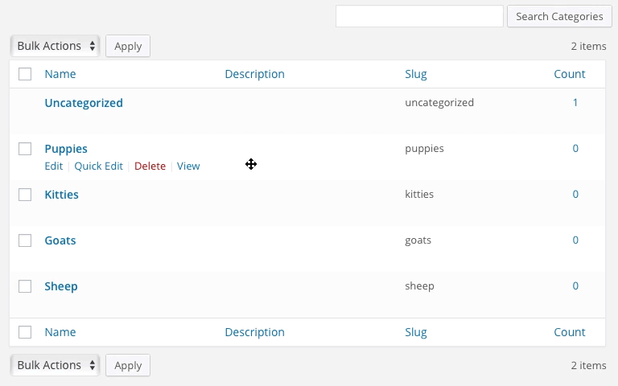

# WP Term Order

Sort taxonomy terms, your way.

WP Term Order allows users to order any visible category, tag, or taxonomy term numerically, providing a customized order for their taxonomies.

# Installation

* Download and install using the built in WordPress plugin installer.
* Activate in the "Plugins" network admin panel using the "Activate" link.
* When activating for an entire network, each site will have it's own ordering.

# Demo



# FAQ

### Does this create new database tables?

No. There are no new database tables with this plugin.

### Does this modify existing database tables?

Yes. The `wp_term_taxonomy` table is altered, and an `order` column is added.

### Can I query and sort by `order`?

Yes. Use it like:

```
$terms = get_terms( 'category', array(
	'depth'      => 1,
	'number'     => 100,
	'parent'     => 0,
	'orderby'    => 'order', // <--- Looky looky!
	'order'      => 'ASC',
	'hide_empty' => false,

	// Try the "wp-term-meta" plugin!
	'meta_query' => array( array(
		'key' => 'term_thumbnail'
	) )
) );
```

### Where can I get support?

The WordPress support forums: https://wordpress.org/tags/wp-term-order/

### Can I contribute?

Yes, please! The number of users needing more robust taxonomy term ordering is growing fast. Having an easy-to-use UI and powerful set of functions is critical to managing complex WordPress installations. If this is your thing, please help us out!
