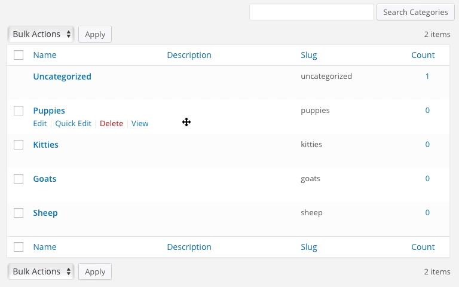

# WP Term Order

Sort taxonomy terms, your way.

WP Term Order allows users to order any visible category, tag, or taxonomy term numerically, providing a customized order for their taxonomy terms.

# Installation

* Download and install using the built in WordPress plugin installer.
* Activate in the "Plugins" area of your admin by clicking the "Activate" link.
* No further setup or configuration is necessary.

# Demo



# FAQ

### Does this create new database tables?

No. There are no new database tables with this plugin.

### Does this modify existing database tables?

Yes. The `wp_term_taxonomy` table is altered, and an `order` column is added.

### Can I query and sort by `order`?

Yes. Use it like:

```
$terms = get_terms( array(
	'taxonomy'   => 'category',
	'depth'      => 1,
	'number'     => 100,
	'parent'     => 0,
	'orderby'    => 'order', // <--- Looky looky!
	'order'      => 'ASC',
	'hide_empty' => false,

	// Try the "wp-term-meta" plugin!
	'meta_query' => array( array(
		'key' => 'term_thumbnail'
	) )
) );
```

For a supported taxonomy, an explicit `orderby` value of `order` is always
honored. To preserve a different ordering for one query while leaving WP Term
Order enabled for its taxonomy, pass `wp_term_order_override` as `false`:

```
$terms = get_terms( array(
	'taxonomy'              => 'category',
	'orderby'               => 'name',
	'wp_term_order_override' => false,
) );
```

The `wp_term_order_taxonomy_override_orderby_supported` filter controls only
the implicit override of WordPress's default term-name ordering. It does not
disable an explicit `orderby` value of `order`.

### Can terms be ordered differently for each post?

Yes. Categories and tags support per-post ordering automatically. For a custom
taxonomy, opt in with the object-ordering filter:

```
add_filter( 'wp_term_order_object_taxonomy_supported', function( $supported, $taxonomies ) {
	return in_array( 'genre', $taxonomies, true ) ? true : $supported;
}, 10, 2 );
```

The post editor adds an order panel for each supported taxonomy. WordPress
stores that order in `wp_term_relationships.term_order`, so no additional table
or post metadata is required. Standard template functions such as
`get_the_terms()` use the saved per-post order. For a direct object-term query,
use WordPress's native `term_order` value:

```
$terms = wp_get_object_terms( $post_id, 'genre', array(
	'orderby' => 'term_order',
	'order'   => 'ASC',
) );
```

The `wp_term_order_object_taxonomy_supported` filter can enable or disable the
feature for an individual taxonomy.

### Where can I get support?

The WordPress support forums: https://wordpress.org/support/plugin/wp-term-order/

### Can I contribute?

Yes, please! The number of users needing more robust taxonomy term ordering is growing fast. Having an easy-to-use UI and powerful set of functions is critical to managing complex WordPress installations. If this is your thing, please help us out!
